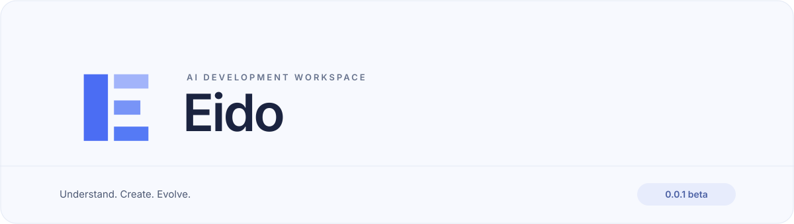

  

<h1 align="center">让想法成为你能掌握的代码。</h1>

  理解代码，与 AI 协作开发，审阅每一项重要改动。 
  从提出目标到验证结果，在同一个工作空间里完成。

  <a href="README.md">English</a> · <strong>简体中文</strong>

  <a href="#eido-的核心体验">核心体验</a> ·
  <a href="#下载与安装">下载</a> ·
  <a href="#开始你的第一个任务">开始试用</a> ·
  <a href="#关于这个-beta-版本">版本范围</a> ·
  <a href="#一起打磨下一个版本">反馈建议</a> ·
  <a href="#致谢与开源协议">开源致谢</a>

---

Eido 将 AI 对话与代码放在一起。描述你想实现的目标，提供必要的上下文，再到编辑器里理解和完善结果。从讨论方案到落地实现，任务、改动与审阅决定始终保持关联。

**Eido 0.0.1 beta 是首个 macOS 预览版本。** 下载应用，从真实项目中的一个明确任务开始试用。

  <a href="https://github.com/tony3liu/eido/releases/download/v0.0.1-beta/Eido-0.0.1-beta-macos-arm64.dmg"><strong>下载 Mac 版 · Apple Silicon</strong></a> ·
  <a href="https://github.com/tony3liu/eido/releases/tag/v0.0.1-beta">版本说明</a>

macOS 13 及以上 · Apple Silicon（M 系列）· 早期测试版

## Eido 的核心体验

### 从目标开始

理解不熟悉的代码、定位一个问题，或描述想增加的功能。通过 `@` 将相关代码带入对话，让讨论围绕你的项目展开。

> **可以从一个明确的小任务开始** 
> “解释这个模块的工作方式，定位这个 bug 的原因，提出一个尽量小的修复，并说明如何验证。”

### 与 AI 并肩开发

在同一个工作空间里阅读文件、修改代码、查看 AI 的进展。根据当前工作切换视图：

| 视图 | 适合的工作 |
| :--- | :--- |
| **Workbench** | 讨论目标、跟进对话、协调任务。 |
| **Code** | 阅读、导航和编辑项目代码。 |
| **Split** | 同时查看对话与代码，边讨论边修改。 |

切换视图时，对话和输入草稿会保留。你可以随时改变关注点，不必重新组织思路。

### 由你决定留下哪些改动

在原生审阅界面中查看提议的改动，决定接受或拒绝。文件删除和二进制改动在接受之前保持待审阅状态。已接受且支持恢复的文件操作，可以在检查后恢复；检查会保护你之后的编辑。

审阅是开发过程的一部分：理解改动、检查结果，再决定哪些内容应该进入项目。

### 带着上下文继续

返回之前的任务，查看当时的对话与审阅上下文。继续被打断的工作，不必从头解释。Eido 也为任务状态和支持的文件操作提供恢复能力。

### 将工作延伸到编辑器之外

让 AI 配合代码任务查看网页、操作桌面应用。本版提供 Browser Use 和 Computer Use，已启用工具的使用遵循你选择的 Agent Access。不同网站与应用的适配仍在持续完善。

## 下载与安装

1. 下载 [Eido-0.0.1-beta-macos-arm64.dmg](https://github.com/tony3liu/eido/releases/download/v0.0.1-beta/Eido-0.0.1-beta-macos-arm64.dmg)。
2. 打开磁盘映像，将 **Eido** 拖入 **Applications**。
3. 启动 Eido，在全局设置中配置模型与认证信息。

此测试版已做本地签名，尚未通过 Apple 公证。如果 macOS 阻止首次启动，请确认下载来源后，按照 Apple 的[打开未知开发者应用说明](https://support.apple.com/zh-cn/guide/mac-help/mh40616/mac)操作。Release 同时提供 SHA-256 校验文件与源码包。

### 在 Mac 上开启 Computer Use

在 Eido 全局设置中启用 **Computer Use**。应用已内置桌面驱动，驱动路径留空即可使用。

到 **系统设置 → 隐私与安全性**，分别在 **辅助功能** 和 **屏幕与系统音频录制**（部分 macOS 版本名为 **屏幕录制**）中允许 **Eido**，然后重启应用。这两项权限用于操作应用与采集窗口。以前授予独立 Cua Driver 的权限不会自动转移给 Eido。本版暂时需要手动完成这些步骤。

## 开始你的第一个任务

**1. 打开项目** 
从 Applications 启动 **Eido**，打开一个项目文件夹。建议先选择一个有版本记录的小项目。

**2. 选择工作方式** 
在全局设置中配置模型与认证信息。对话输入框旁提供模型、思考级别和 **Agent Access** 控件。

**3. 给任务一个明确的完成条件** 
说明希望改变什么，以及怎样判断结果有效。引用相关代码，让 AI 调查问题并提出方案。

**4. 审阅并验证** 
检查改动，运行相关验证，再决定保留哪些结果。如果还有偏差，就在同一个任务中继续完善。

### 自己选择授权程度

| Agent Access | 工作方式 |
| :--- | :--- |
| **Ask Before Actions** | 对需要批准的操作先询问。适合初次试用、熟悉工作流程时使用。 |
| **Full Access** | AI 自行决定如何使用已启用的工具，不再逐项请求批准。 |

Agent Access 在所有任务之间全局生效。配置与工作历史保存在应用安装包之外，本地更新时会保留。模型请求会发送给你配置的服务提供方。

## 关于这个 beta 版本

首版围绕一个可用的开发流程展开：**描述目标 → 调查问题 → 修改代码 → 审阅改动 → 验证结果**。

| 当前可以试用 | 仍在完善 |
| :--- | :--- |
| 带项目上下文的 AI 对话与工具执行。 | Agent 命令与扩展能力的完整覆盖。 |
| 原生文件编辑与代码审阅。 | 不同项目的语言支持与智能编辑配置。 |
| 共享对话的 Workbench、Code、Split 三种视图。 | Agent 生态中的插件兼容性。 |
| 任务历史、支持的文件操作审阅与恢复。 | 大项目性能，以及更多升级和恢复场景。 |
| Browser Use，以及内置桌面驱动的 Computer Use。 | 不同网站与应用的兼容性，以及 macOS 权限引导。 |

智能代码辅助取决于已配置的语言支持。这个预览版本用于发现实际使用中的问题，推动下一版改进；目前不承诺完整适配所有项目或插件。应用界面的文案为英文，本文中的控件名称与界面一致。

## 一起打磨下一个版本

最有价值的反馈来自一次真实任务。欢迎[提交 Issue](https://github.com/tony3liu/eido/issues)，并附上：

- **你的目标**：当时想完成什么。
- **遇到的阻碍**：预期怎样，实际发生了什么。
- **一个简短示例**：复现步骤、截图或相关错误信息。
- **版本信息**：Eido **0.0.1 beta**，以及 macOS 版本。

分享示例前，请移除凭据和不适合公开的项目内容。

## 致谢与开源协议

Eido 建立在 **[Zed](https://github.com/zed-industries/zed)** 与 **[pi](https://github.com/earendil-works/pi)** 的开源成果之上。Zed 提供原生编辑器基础，pi 提供编程 Agent 能力。感谢两个项目的作者、贡献者与社区，让这些优秀的工具以开源方式惠及更多开发者。

Eido 尊重并保留这两个项目的许可证与署名。**Eido 自有代码采用 GPL-3.0-or-later**，与 Zed 编辑器代码的许可证一致。

| 代码范围 | 开源协议 |
| :--- | :--- |
| Eido 自有代码与 Zed 编辑器代码 | [GPL-3.0-or-later](LICENSE) |
| Zed 中标明 Apache-2.0 的组件，包括 GPUI | [Apache-2.0](native/LICENSE-APACHE) |
| pi | [MIT](https://github.com/earendil-works/pi/blob/main/LICENSE) |
| Cua Driver 桌面运行时 | [MIT](native/cua/LICENSE-MIT) |

如果你 fork、修改或分发 Eido，需要遵守所包含各组件的许可证：保留许可证全文、版权与署名，以及要求的修改声明。分发受 GPL 约束的二进制程序时，须通过 GPL 允许的方式提供对应源码，并保留其授权条款。其他依赖仍适用各自的许可证；具体归属与范围见 [NOTICE](NOTICE)。本说明不替代许可证全文。

---

  <strong>理解。创造。演进。</strong> 
  Eido · 0.0.1 beta · macOS 预览版

